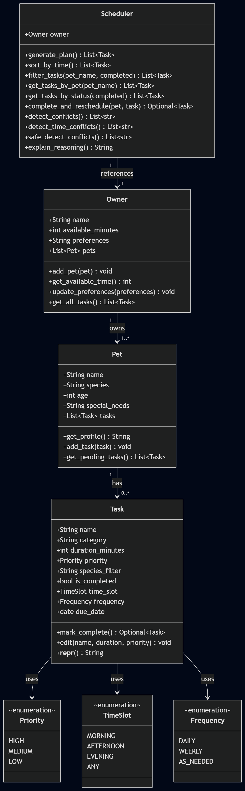

# PawPal+ (Module 2 Project)

You are building **PawPal+**, a Streamlit app that helps a pet owner plan care tasks for their pet.

## Scenario

A busy pet owner needs help staying consistent with pet care. They want an assistant that can:

- Track pet care tasks (walks, feeding, meds, enrichment, grooming, etc.)
- Consider constraints (time available, priority, owner preferences)
- Produce a daily plan and explain why it chose that plan

Your job is to design the system first (UML), then implement the logic in Python, then connect it to the Streamlit UI.

## What you will build

Your final app should:

- Let a user enter basic owner + pet info
- Let a user add/edit tasks (duration + priority at minimum)
- Generate a daily schedule/plan based on constraints and priorities
- Display the plan clearly (and ideally explain the reasoning)
- Include tests for the most important scheduling behaviors

## Getting started

### Setup

```bash
python -m venv .venv
source .venv/bin/activate  # Windows: .venv\Scripts\activate
pip install -r requirements.txt
```

### Suggested workflow

1. Read the scenario carefully and identify requirements and edge cases.
2. Draft a UML diagram (classes, attributes, methods, relationships).
3. Convert UML into Python class stubs (no logic yet).
4. Implement scheduling logic in small increments.
5. Add tests to verify key behaviors.
6. Connect your logic to the Streamlit UI in `app.py`.
7. Refine UML so it matches what you actually built.

---

## Testing PawPal+

### How to Run Tests

From the root `PawPal` directory, run:

```bash
python -m pytest tests/
```

To run with detailed output:

```bash
python -m pytest tests/ -v
```

---

### What the Tests Cover

**Task Completion**
- Verifies that `mark_complete()` correctly flips `is_completed` to `True`
- Verifies that adding a task to a `Pet` increases its task count

**Sorting Correctness**
- Verifies tasks added out of order are returned in chronological order (MORNING → AFTERNOON → EVENING)
- Verifies no tasks are lost when multiple tasks share the same time slot

**Recurrence Logic**
- Verifies a `DAILY` task returns a new task due tomorrow when completed
- Verifies a `WEEKLY` task returns a new task due in 7 days when completed
- Verifies an `AS_NEEDED` task returns `None` no new task created
- Verifies `complete_and_reschedule()` adds the next occurrence directly to the pet's task list

**Conflict Detection**
- Verifies no conflict is reported when tasks are spread across different time slots
- Verifies a conflict warning is raised when two pets have tasks in the same slot
- Verifies `safe_detect_conflicts()` returns a clean confirmation message when no issues exist

---

### Confidence Level

★★★★☆ (4 out of 5)

11 out of 11 tests pass. Core behaviors such as task completion, sorting, recurrence, and conflict detection are all verified. I said 4 stars because edge cases like an empty owner (no pets), zero available minutes, and duplicate task completion are not yet covered by the test suite.




